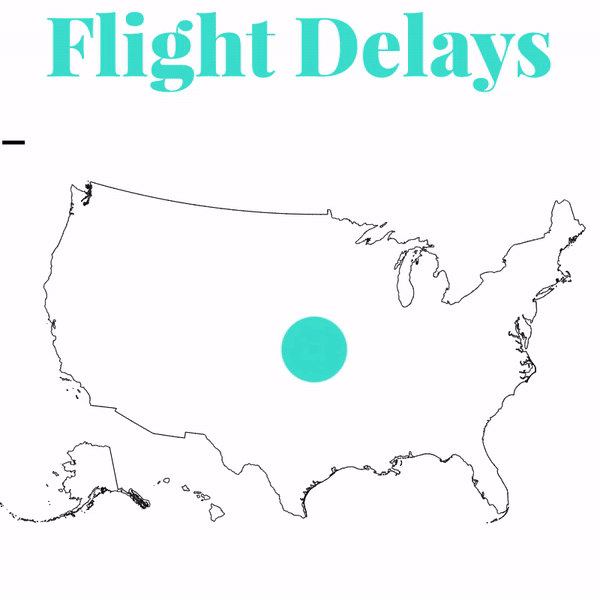
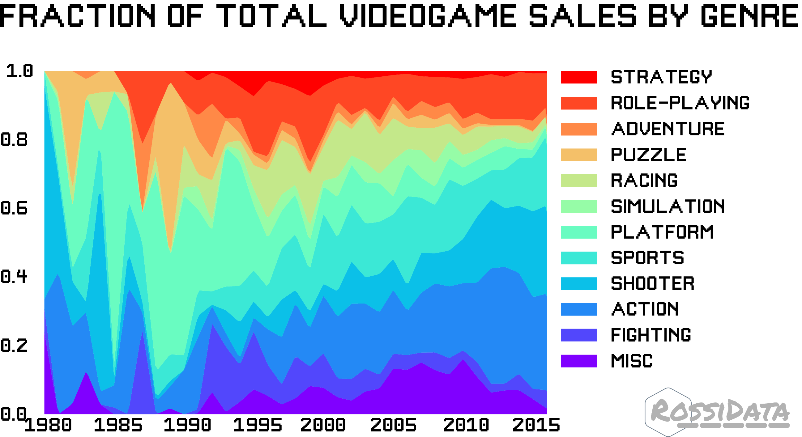
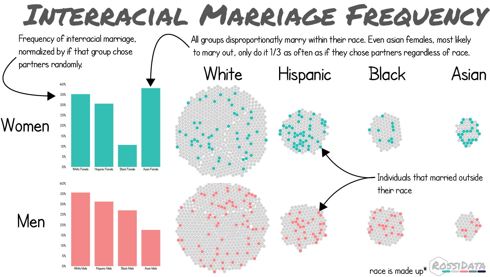

# VizSnacks
This is a random assortment of visualizations that don't deserve their own repo. Mostly D3.js and Python

## Flight Delays
A d3.js visulazation showing the worst airports and states in terms of total flight delays and percentage of flights delayed. Data was collected from [here](https://www.icao.int/safety/iStars/Pages/API-Data-Service.aspx)

## Videogame Genres Over Time
A python based stackchart using data from [here](https://www.kaggle.com/gregorut/videogamesales)

## Interracial Marriage:
A d3.js visulazation remixing some pew research data showing which groups are most likely to be in an interracial marriage normalized by the size of that group.

