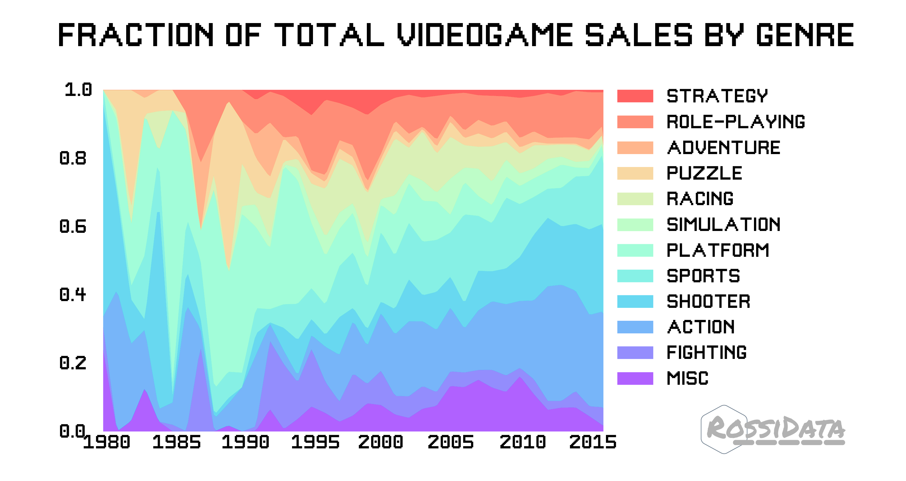
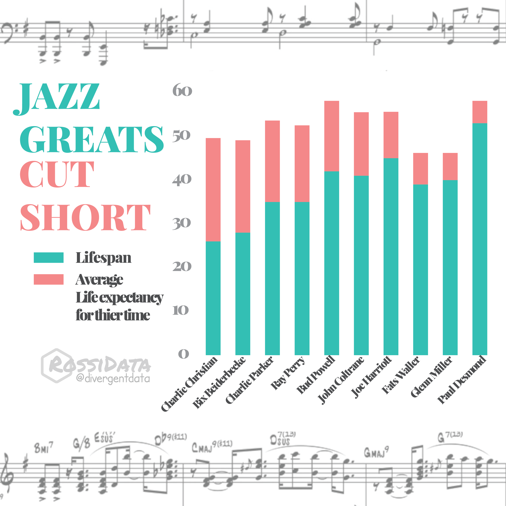
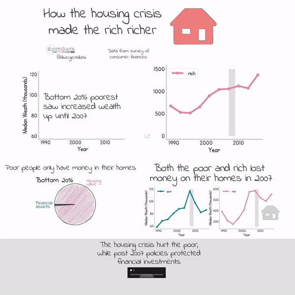

# VizSnacks
This is a random assortment of visualizations that don't deserve their own repo. Mostly D3.js and Python

## Flight Delays
A d3.js visulazation showing the worst airports and states in terms of total flight delays and percentage of flights delayed. Data was collected from [here](https://www.icao.int/safety/iStars/Pages/API-Data-Service.aspx)

## Videogame Genres Over Time
A python based stackchart using data from [here](https://www.kaggle.com/gregorut/videogamesales)

## Interracial Marriage:
A d3.js visulazation remixing some pew research data showing which groups are most likely to be in an interracial marriage normalized by the size of that group.

## Jazz Greats:
A python visulaization showing jazz greats that died sooner than the life-expectancy average of the year they were born in (data grabbed from wikipedia)

## Housing Crisis:
Using the [survey of consumer finances](https://www.federalreserve.gov/econres/scfindex.htm) I plotted the winners and loser of the financial crisis. Generally, the rich did well and the poor did badly because of how they they keep their wealth.

